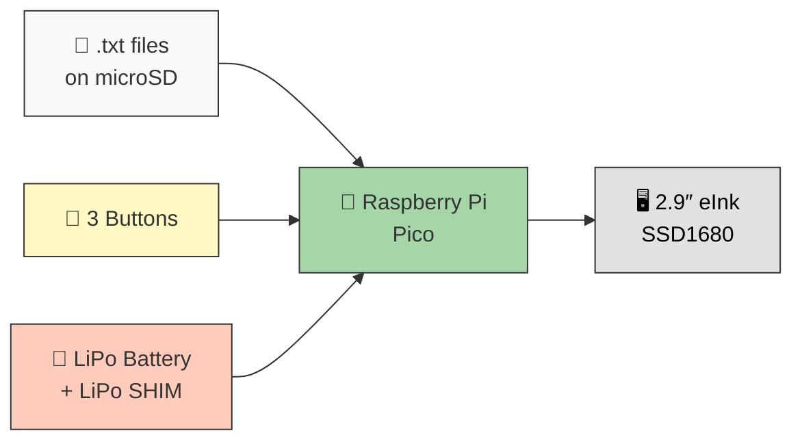
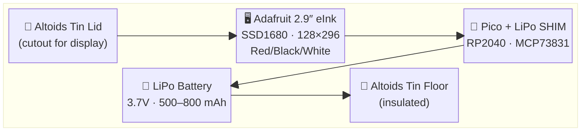
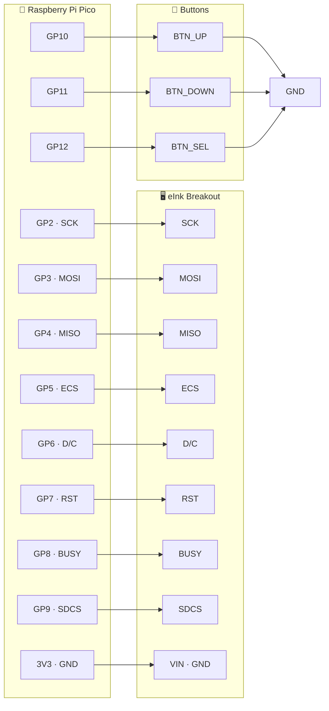
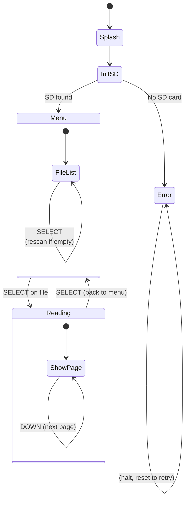

# Altoid eInk Reader

*A pocket-sized eInk reader that fits in an Altoids tin — reads `.txt` files off a microSD card with three-button navigation.*

[](LICENSE)


---

## 📖 Overview

The Altoid eInk Reader is a self-contained, battery-powered device that displays plain-text files on a 2.9" tri-color eInk screen. Drop `.txt` files onto a microSD card, insert it, and read — no computer, no phone, no distractions.



## 🔗 Key Components

| Component | Product | Link |
|-----------|---------|------|
| Display | Adafruit 2.9″ Tri-Color eInk Breakout (SSD1680) | [PID 1028](https://www.adafruit.com/product/1028) |
| MCU | Raspberry Pi Pico (RP2040) | [Pico](https://www.raspberrypi.com/products/raspberry-pi-pico/) |
| Power | Pimoroni Pico LiPo SHIM (MCP73831) | [PIM557](https://shop.pimoroni.com/products/pico-lipo-shim) |
| Battery | LiPo 3.7V (500–2000 mAh) | JST-PH connector |

## 🧱 Hardware



### Bill of Materials

| Ref | Qty | Part | Link | Notes |
|-----|-----|------|------|-------|
| U1 | 1 | Raspberry Pi Pico | [Buy](https://www.raspberrypi.com/products/raspberry-pi-pico/) | RP2040, 40-pin DIP |
| U2 | 1 | Adafruit 2.9″ Tri-Color eInk Breakout | [Buy](https://www.adafruit.com/product/1028) | SSD1680, 128×296, microSD slot |
| U3 | 1 | Pimoroni Pico LiPo SHIM | [Buy](https://shop.pimoroni.com/products/pico-lipo-shim) | PIM557, MCP73831 charger |
| SW1–3 | 3 | Tactile switch, SPST-NO | — | 6 mm, for navigation |
| BAT | 1 | LiPo battery, 3.7 V | — | 500–2000 mAh, JST-PH 2-pin |
| — | 1 | Altoids tin | — | Standard size (~95×60×20 mm) |

### Pin Connections



Buttons are **active-low** with internal pull-ups — no external resistors needed.  
Battery level is read via Pico's internal **ADC3** (VSYS/3) — no extra pin.

### Schematic

The `hardware/` folder contains a KiCad 8 project:

```
hardware/
├── Altoid_eink.kicad_pro    ← KiCad project
├── Altoid_eink.kicad_sch    ← Schematic (5 symbols, 13 nets)
├── generate_schematic.py    ← Regenerate from Python
├── schematic_ascii.txt      ← Visual reference diagram
└── README.md                ← BOM, netlist, enclosure notes
```

Open `Altoid_eink.kicad_pro` in KiCad 8 to view or export the schematic. The PCB designer should start here.

---

## 💾 Firmware

Written in **MicroPython** for Raspberry Pi Pico.

```mermaid
graph TD
    main["main.py<br/>Boot entry"] --> reader["reader.py<br/>Reader app"]

    reader --> sd["sdcard.py<br/>SPI SD card<br/>block device"]
    reader --> display["ssd1680.py<br/>eInk display driver"]
    reader --> font["font5x7.py<br/>5×7 bitmap font<br/>+ text rendering"]

    sd --> spi["machine.SPI(0)<br/>Shared bus"]
    display --> spi

    style main fill:#c8e6c9,stroke:#333
    style reader fill:#a5d6a7,stroke:#333
    style sd fill:#fff9c4,stroke:#333
    style display fill:#fff9c4,stroke:#333
    style font fill:#fff9c4,stroke:#333
    style spi fill:#e1e1e1,stroke:#333,color:#000
```



| File | Purpose | Lines |
|------|---------|-------|
| `main.py` | Boot entry point | 8 |
| `reader.py` | App loop, UI, pagination, button handling | 376 |
| `ssd1680.py` | SSD1680 eInk driver (init, draw, refresh) | 228 |
| `sdcard.py` | SPI SD card block device (read/write/mount) | 306 |
| `font5x7.py` | 5×7 bitmap font + word-wrapped text rendering | 167 |

### UI Flow



### Display Specs

| Parameter | Value |
|-----------|-------|
| Driver IC | SSD1680 |
| Resolution | 128 × 296 (portrait) |
| Colors | Black, White, Red |
| Characters per line | ~21 (5×7 font + spacing) |
| Lines per page | ~32 |
| Page refresh time | ~15 s (full update) |
| Interface | 4-wire SPI |

---

## 🚀 Getting Started

### 1. Flash MicroPython to Pico

1. Hold the **BOOTSEL** button on the Pico
2. Connect USB — the Pico appears as a USB drive (`RPI-RP2`)
3. Download the latest MicroPython UF2 from [micropython.org/download/RPI_PICO](https://micropython.org/download/RPI_PICO/)
4. Drag the `.uf2` file onto the drive — the Pico reboots into MicroPython

### 2. Deploy the firmware

```bash
# Install deployment tool
pip install mpremote

# Copy all firmware files to Pico
./deploy.sh /dev/ttyACM0
```

Or use **Thonny IDE** — open each file in `firmware/` and save it to the Pico.

### 3. Prepare the SD card

Format a microSD card as **FAT32**, copy `.txt` files to the root, and insert into the eInk breakout's SD slot.

### 4. Power on

Connect a LiPo battery to the LiPo SHIM, flip the power switch, and the reader boots directly into the file menu.

---

## 📁 Project Structure

```
Altoid_eink/
├── firmware/                MicroPython (runs on Pico)
│   ├── main.py              Entry point
│   ├── reader.py            Reader app (menu, view, navigation)
│   ├── ssd1680.py           SSD1680 eInk display driver
│   ├── sdcard.py            SPI SD card block device
│   └── font5x7.py           5×7 font + word-wrap renderer
│
├── hardware/                KiCad schematic
│   ├── Altoid_eink.kicad_pro   Project file (KiCad 8)
│   ├── Altoid_eink.kicad_sch   Schematic
│   ├── generate_schematic.py   Regenerate schematic
│   ├── schematic_ascii.txt     Visual pinout diagram
│   └── README.md               BOM, netlist, enclosure notes
│
├── docs/
│   └── pinout.md            Detailed pin mapping
│
├── deploy.sh                Flash firmware to Pico
└── .gitignore
```

---

## 🛠️ Development

### Regenerating the Schematic

If you modify `hardware/generate_schematic.py`:

```bash
cd hardware
python3 generate_schematic.py
```

### Enclosure

Target enclosure is a standard **Altoids tin** (~95×60×20 mm internal dimensions):

- **Display cutout:** ~31×69 mm centered on the lid
- **Button holes:** 3× 7 mm holes along the bottom edge
- **Stackup** (bottom → top): insulated tin floor → LiPo battery → Pico + LiPo SHIM → eInk breakout → lid

### Testing Without Buttons or SD Card

Use `firmware/test_display.py` to verify wiring before deploying the full reader:

```bash
mpremote connect /dev/ttyACM1 fs cp firmware/test_display.py :main.py
mpremote connect /dev/ttyACM1 reset
```

This runs 5 visual tests (color bars, checkerboard, borders, text, grid) — no buttons or SD card needed.

## ⚠️ Troubleshooting

### Display stays blank

1. **Check power:** The eInk breakout needs 3.3 V on VIN. If using the Pico's 3V3 pin (pin 36), verify it reads 3.3 V. The breakout also accepts 5 V on VIN (it has an onboard regulator).
2. **Check the ribbon cable:** The flat flex cable connecting the glass panel to the green PCB must be fully inserted and latched. Push it firmly into the connector and flip the black latch down.
3. **Solder headers on the Pico:** Loose jumper wires on bare Pico pads do **not** make reliable contact for high-speed SPI. Solder pin headers (or at minimum push solid wire through the holes).
4. **Pin mapping:** Double-check every connection against the pinout diagram above. One swapped wire (especially CS vs D/C, or SCK vs MOSI) gives a blank screen.
5. **Run `test_display.py`** (see above) — it prints status to the serial console so you can see which step fails.

### BUSY pin timeout

If the display hangs with "BUSY timeout", check the BUSY pin connection (GP8 → BUSY). If BUSY is floating (disconnected), the driver will wait forever.

### SD card not detected

- Format the card as **FAT32** (not exFAT).
- Check SDCS connection (GP9 → SDCS).
- The card must be inserted before power-on.

---

## 📄 License

MIT — see [LICENSE](LICENSE) file.

---

## 🔗 References

- [Raspberry Pi Pico Datasheet](https://datasheets.raspberrypi.com/pico/pico-datasheet.pdf)
- [Adafruit 2.9″ eInk Breakout](https://www.adafruit.com/product/1028)
- [Pimoroni Pico LiPo SHIM](https://shop.pimoroni.com/products/pico-lipo-shim)
- [SSD1680 Datasheet](https://cdn-learn.adafruit.com/assets/assets/000/131/641/original/SSD1680.pdf)
- [MicroPython for RP2040](https://micropython.org/download/RPI_PICO/)
