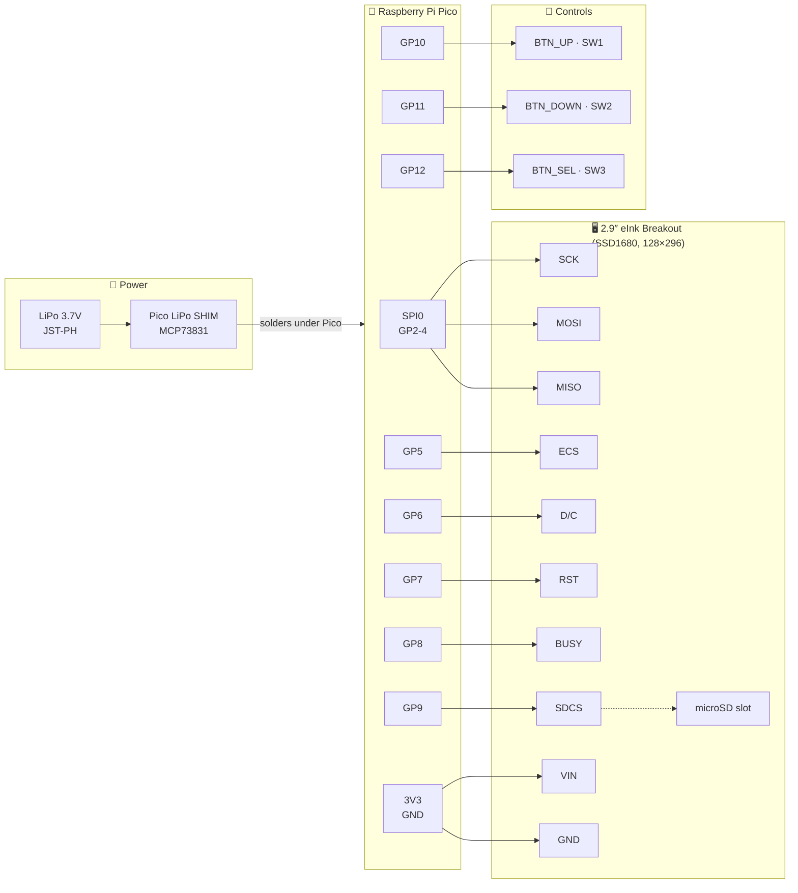
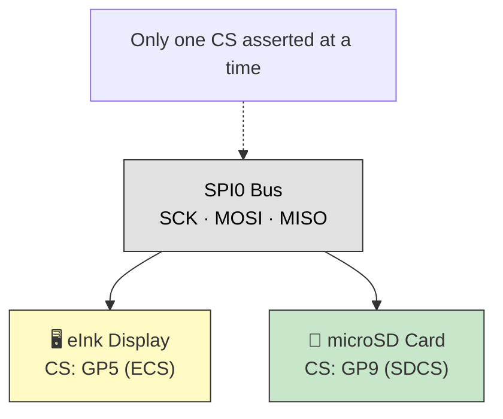
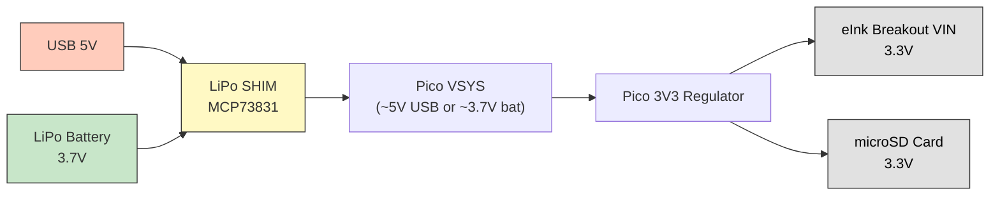

# Altoid eInk Reader — Schematic

Raspberry Pi Pico wired to Adafruit 2.9″ Tri-Color eInk Breakout (SSD1680).

## System Block Diagram

## Pin Connections

| Pico Pin | GPIO | Signal | → | eInk Breakout |
|----------|------|--------|---|--------------|
| 4 | GP2 (SPI0 SCK) | SCK | → | SCK |
| 5 | GP3 (SPI0 TX) | MOSI | → | MOSI |
| 6 | GP4 (SPI0 RX) | MISO | → | MISO |
| 7 | GP5 | ECS | → | ECS |
| 9 | GP6 | D/C | → | D/C |
| 10 | GP7 | RST | → | RST |
| 11 | GP8 | BUSY | → | BUSY |
| 12 | GP9 | SDCS | → | SDCS |
| 36 | 3V3(OUT) | VIN | → | VIN |
| 38 | GND | GND | → | GND |

### Button Wiring

| Pico Pin | GPIO | Button | Function |
|----------|------|--------|----------|
| 14 | GP10 | SW1 | Previous page / Up |
| 15 | GP11 | SW2 | Next page / Down |
| 16 | GP12 | SW3 | Select / Menu |

All buttons: GPIO → button → GND. Active low with internal pull-up (no external resistors needed).

### Power Wiring

The [Pimoroni Pico LiPo SHIM (PIM557)](https://shop.pimoroni.com/products/pico-lipo-shim) solders directly to the back of the Pico:

| SHIM pad | Pico pad |
|----------|----------|
| VBUS | VBUS (pin 40) |
| VSYS | VSYS (pin 39) |
| GND | GND (pin 38) |
| 3V3_EN | 3V3_EN (pin 37) |

Battery connects via JST-PH 2-pin on the SHIM. Battery level read via Pico ADC3 (VSYS/3).

## SPI Bus Sharing

## Power Flow

