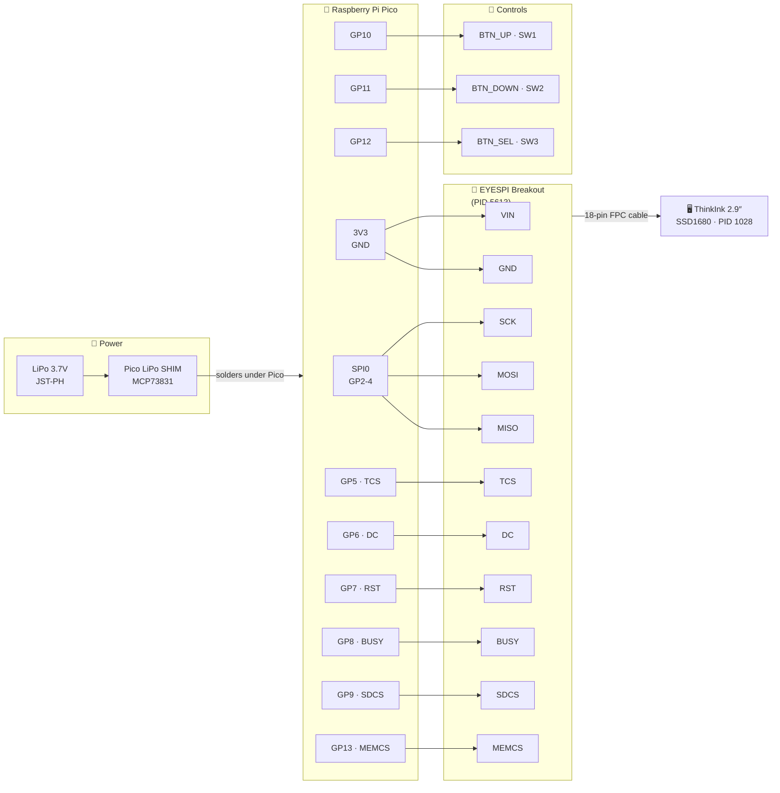
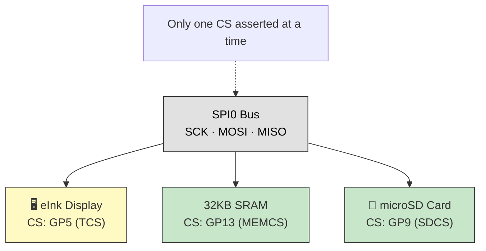
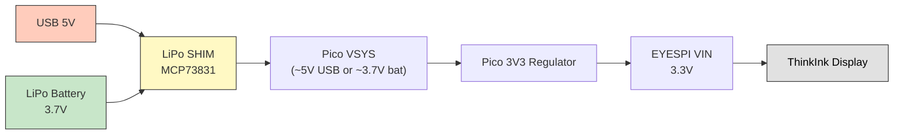

# Altoid eInk Reader — Schematic

Raspberry Pi Pico wired to an Adafruit 2.9" ThinkInk display (PID 1028) through the 18-pin EYESPI connector and EYESPI breakout adapter (PID 5613).

## System Block Diagram

## Pin Connections

| EYESPI label | Pico pin | GPIO / Power |
|--------------|----------|--------------|
| VIN | 36 | 3V3(OUT) |
| GND | 38 | GND |
| SCK | 4 | GP2 |
| MOSI | 5 | GP3 |
| MISO | 6 | GP4 |
| TCS | 7 | GP5 |
| DC | 9 | GP6 |
| RST | 10 | GP7 |
| BUSY | 11 | GP8 |
| SDCS | 12 | GP9 |
| MEMCS | 17 | GP13 |

No `ENA` wire is used with the EYESPI connector.

### Button Wiring

| Pico Pin | GPIO | Button | Function |
|----------|------|--------|----------|
| 14 | GP10 | SW1 | Previous page / Up |
| 15 | GP11 | SW2 | Next page / Down |
| 16 | GP12 | SW3 | Select / Menu |

All buttons: GPIO → button → GND. Active low with internal pull-up (no external resistors needed).

### Power Wiring

The [Pimoroni Pico LiPo SHIM (PIM557)](https://shop.pimoroni.com/products/pico-lipo-shim) solders directly to the back of the Pico:

| SHIM pad | Pico pad |
|----------|----------|
| VBUS | VBUS (pin 40) |
| VSYS | VSYS (pin 39) |
| GND | GND (pin 38) |
| 3V3_EN | 3V3_EN (pin 37) |

Battery connects via JST-PH 2-pin on the SHIM. Battery level read via Pico ADC3 (VSYS/3).

## SPI Bus Sharing

## Power Flow

